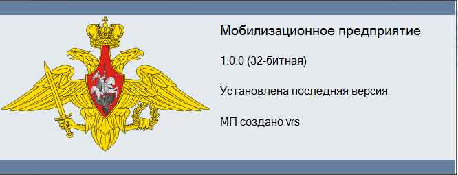
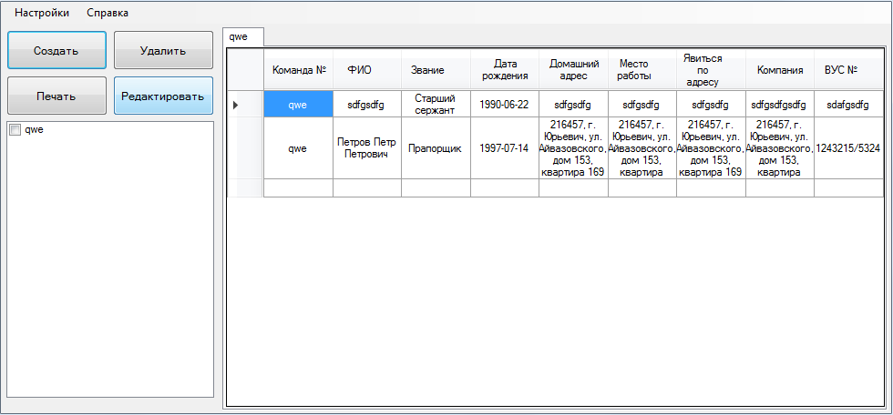
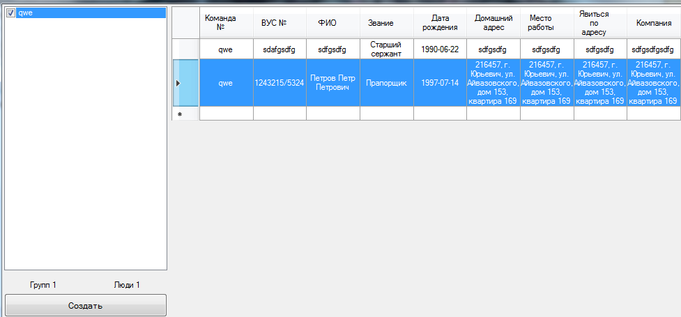
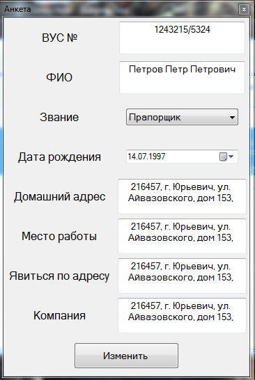
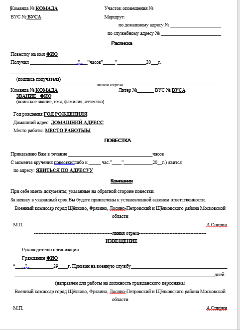
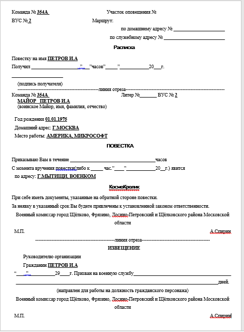

# Mobilization-enterprise
Designed to automate routine tasks
<!DOCTYPE html> 
<html> 
<head> 
</head>
<body> 
	

		
<h2>Info</h2>

		

		
The program is designed to optimize the work with a database consisting of people registered with the military commissariat, as well as to form agendas according to a given template in .docx format.

	

	

		
<h2>Start form</h2>

		

		
The initial window, where you can view by group, change and delete data.

	

	

		
<h2>Print form</h2>

		

		
Window for marking people / groups required for printing.

	

	

		
<h2>Questionnaire</h2>

		

		
A questionnaire for adding new users or changing old ones.

	

	

		
<h2>Template</h2>

		

		
The template in accordance with which the formation of standard documents occurs.

	

	

		
<h2>Final document</h2>

		

		
Finished generated document.

	

</body> 
</html>